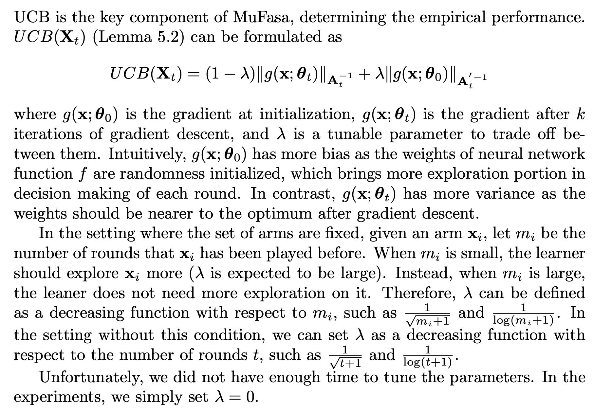

### Multi-facet Contextual Bandits

Contextual multi-armed bandit has shown to be an effective tool in recommender systems. 
In this paper, we study a novel problem of multi-facet bandits involving a group of bandits, each characterizing the users' needs from one unique aspect. 
In each round, for the given user, we need to select one arm from each bandit, such that the combination of all arms maximizes the final reward. 
This problem can find immediate applications in E-commerce, healthcare, etc. 
To address this problem, we propose a novel algorithm, named MuFasa, which utilizes an assembled neural network to jointly learn the underlying reward functions of multiple bandits. 
It estimates an Upper Confidence Bound (UCB) linked with the expected reward to balance between exploitation and exploration. 
Under mild assumptions, we provide the regret analysis of MuFasa. It can achieve the near-optimal $\widetilde{ \mathcal{O}}((K+1)\sqrt{T})$ regret bound where $K$ is the number of bandits and $T$ is the number of played rounds. 
Furthermore, we conduct extensive experiments to show that MuFasa outperforms strong baselines on real-world data sets.

## Setting of UCB

 

## Prerequeistes
CUDA 11.2

torch 1.9.0

torchvision 0.10.0

sklearn 0.24.1

numpy 1.20.1

scipy 1.6.2

pandas 1.2.4

## Hyperparameters

lambda (regularization and adjust UCB): recommend grid search (0.01, 0.001, 0.0001)

nu (adjust UCB): recommend grid search (1, 0.5, 0.1)

## Reference 

### If this paper is inspirational to you, please kindly cite this paper.

@inproceedings{10.1145/3447548.3467299, \
author = {Ban, Yikun and He, Jingrui and Cook, Curtiss B.}, \
title = {Multi-Facet Contextual Bandits: A Neural Network Perspective}, \
year = {2021}, \ 
isbn = {9781450383325}, \
publisher = {Association for Computing Machinery}, \
address = {New York, NY, USA}, \
doi = {10.1145/3447548.3467299}, \ 
booktitle = {Proceedings of the 27th ACM SIGKDD Conference on Knowledge Discovery & Data Mining}, \
pages = {35–45}, \
numpages = {11}, \
location = {Virtual Event, Singapore}, series = {KDD '21} 
}
 
